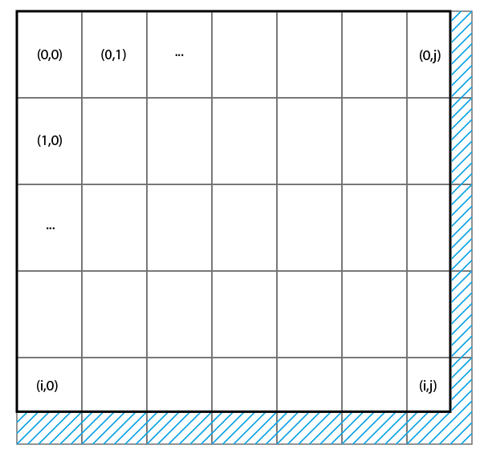
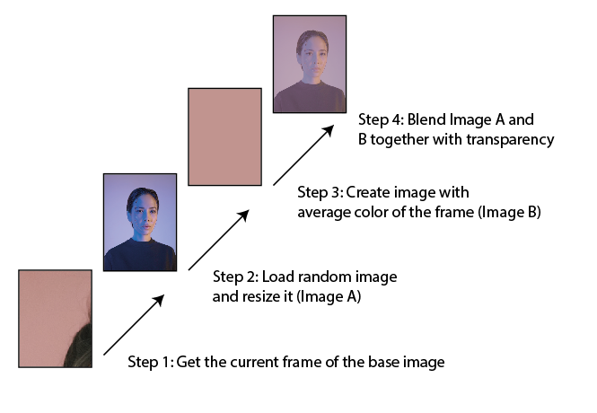

# Generate Mosaic Image


*Fig: base image: test_image_1, desired height: 20, desired width: 10*

This is a mosaic image generator written in Python. You can use a base image and a collection of images that will be used as mosaic piece.

## Process

The base image is split into frames, and we iterate through them row by row. The frame dimensions are specified by the desired height and width. At the end of each row and the bottom row, the overlapping mosaic images are cropped before being stitched onto the base image.



For each frame of the base image, the average color is calculated and blended with a random image before it is stitched into the base image.



The final image is saved in the current directory.

## How to use

You can either change the location of the base image and mosaic_images or place your images there. Then, set your desired height and width and run the program.

```python
    base_img_path = 'resources/base_image/test_image_me.jpg'
    path_to_mosaic_image = 'resources/mosaic_images'
    desired_height = 200
    desired_width =  100
```

## Further Development
This procedure can be used with every mosaic piece or just one, but there are other methods of creating mosaic images. Another way is to find the image that is closest to the average color of the frame and use it as the mosaic piece. This method could be added as an alternative.

Currently, all mosaic pieces are resized to the same dimensions. This means that we cannot maintain the aspect ratio of the original image. With a 2D packing algorithm, it could be possible to preserve the aspect ratio of the original image and create a different mosaic look."

## Resources 

* Test image 1 - https://unsplash.com/de/fotos/bqe0J0b26RQ
* Test image 2 - https://unsplash.com/de/fotos/3TLl_97HNJo
* Test image 3 - https://unsplash.com/de/fotos/QXevDflbl8A
* Test image 4 - https://unsplash.com/de/fotos/mEZ3PoFGs_k
* Test image 5 - https://unsplash.com/de/fotos/C5NOq1BKlAk
* Test image 6 - https://unsplash.com/de/fotos/AHBvAIVqk64

## Links

* Free portrait images - https://unsplash.com/de/s/fotos/portrait

* Article about the process - https://link.medium.com/nsaQm0V3AAb